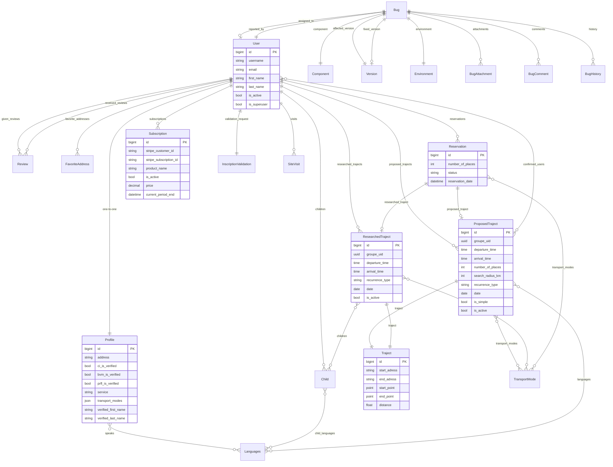

# 03 — Modélisation Base de Données
**Projet :** BanaCommunity (bana.mobi)
**Auditeur :** Analyste Fonctionnel Senior — Digit-Up Agency
**Date :** 2026-06-19

---

## 1. Dictionnaire de Données

### `auth_user` (Django built-in)
| Champ | Type | Contraintes | Description |
|---|---|---|---|
| `id` | BigAutoField | PK | Identifiant |
| `username` | CharField(150) | unique | Identifiant de connexion |
| `email` | CharField(254) | – | Email de connexion (allauth) |
| `first_name` | CharField(150) | blank | Prénom (manuel) |
| `last_name` | CharField(150) | blank | Nom (manuel) |
| `password` | CharField | – | Hash PBKDF2 |
| `is_active` | BooleanField | default=True | Compte activé |
| `is_superuser` | BooleanField | default=False | Accès superadmin |
| `date_joined` | DateTimeField | auto | Date d'inscription |

---

### `accounts.Profile`
| Champ | Type | Contraintes | Description |
|---|---|---|---|
| `id` | BigAutoField | PK | – |
| `user` | OneToOneField(User) | CASCADE | Profil étendu |
| `profile_picture` | ImageField | null, blank | Photo de profil (upload_to='profile_pics/') |
| `address` | CharField(100) | blank | Code postal / ville |
| `ci_is_verified` | BooleanField | default=False | Carte d'identité vérifiée (Stripe Identity) |
| `bvm_is_verified` | BooleanField | default=False | Casier judiciaire validé (admin) |
| `prfl_is_verified` | BooleanField | default=False | Profil complet (photo + adresse + langues) |
| `document_bvm` | FileField | null, blank | Extrait BVM (upload_to='bvm/') |
| `service` | CharField(30) | choices: Parent/Yaya | Rôle sur la plateforme |
| `languages` | ManyToManyField(Languages) | blank | Langues parlées |
| `transport_modes` | JSONField | default=[] | Modes de transport préférés |
| `bio` | TextField | null, blank | Biographie |
| `verified_first_name` | CharField(100) | null, blank | Prénom extrait de la CI (Stripe) |
| `verified_last_name` | CharField(100) | null, blank | Nom extrait de la CI (Stripe) |
| `onboarding_seen` | BooleanField | default=False | Indique si le message de bienvenue a été vu |

**Note :** Le champ `stripe_customer_id` est **absent** de ce modèle alors qu'il est référencé dans `stripe_sub/views.py`. C'est un bug fonctionnel.

---

### `accounts.Languages`
| Champ | Type | Contraintes | Description |
|---|---|---|---|
| `id` | BigAutoField | PK | – |
| `lang_name` | CharField(50) | unique | Nom complet |
| `lang_abbr` | CharField(3) | unique | Abréviation (fr, en, nl…) |

**Meta :** `ordering = ["lang_name"]`

---

### `accounts.Child`
| Champ | Type | Contraintes | Description |
|---|---|---|---|
| `id` | BigAutoField | PK | – |
| `chld_user` | ForeignKey(User) | CASCADE, related_name='children' | Parent propriétaire |
| `chld_name` | CharField(100) | null | Nom |
| `chld_surname` | CharField(100) | null | Prénom |
| `chld_birthdate` | DateField | – | Date de naissance |
| `chld_gender` | CharField(10) | choices: Garçon/Fille | Genre |
| `chld_seat` | BooleanField | default=False | Siège enfant nécessaire |
| `chld_disability` | BooleanField | default=False | Porteur d'un handicap |
| `chld_special_needs` | TextField | null, blank | Besoins spécifiques |
| `chld_languages` | ManyToManyField(Languages) | blank | Langues parlées |

---

### `accounts.Review`
| Champ | Type | Contraintes | Description |
|---|---|---|---|
| `id` | BigAutoField | PK | – |
| `reviewer` | ForeignKey(User) | CASCADE, related_name='given_reviews' | Auteur de l'avis |
| `reviewed_user` | ForeignKey(User) | CASCADE, related_name='received_reviews' | Utilisateur noté |
| `rating` | IntegerField | choices: 1-5 | Note |
| `comment` | TextField | null, blank | Commentaire libre |
| `created_at` | DateTimeField | auto_now_add | Date de création |

---

### `accounts.FavoriteAddress`
| Champ | Type | Contraintes | Description |
|---|---|---|---|
| `id` | BigAutoField | PK | – |
| `uid` | UUIDField | db_index, editable=False | Identifiant public |
| `user` | ForeignKey(User) | CASCADE, related_name='favorite_addresses' | Propriétaire |
| `label` | CharField(60) | – | Libellé (ex: Maison, École) |
| `address` | CharField(255) | – | Adresse textuelle |
| `place_id` | CharField(255) | null, blank | ID Google/OSM |
| `point` | PointField | srid=4326, geography=True, null, blank | Coordonnée GPS |
| `created_at` | DateTimeField | auto_now_add | – |

**Meta :** `ordering = ["label"]`, `unique_together = [("user", "label")]`

---

### `trajects.Traject`
| Champ | Type | Contraintes | Description |
|---|---|---|---|
| `id` | BigAutoField | PK | – |
| `start_adress` | CharField(255) | – | Adresse de départ |
| `end_adress` | CharField(255) | – | Adresse d'arrivée |
| `start_place_id` | CharField(255) | null, blank | ID OSM départ |
| `end_place_id` | CharField(255) | null, blank | ID OSM arrivée |
| `start_point` | PointField | srid=4326, geography=True, null, blank | Coordonnée départ |
| `end_point` | PointField | srid=4326, geography=True, null, blank | Coordonnée arrivée |
| `address` | CharField(255) | null, blank | *(à supprimer — commentaire dans code)* |
| `distance` | FloatField | null, blank | Distance calculée |
| `created_at` | DateTimeField | auto_now_add | – |

**Meta :** `ordering = ["-created_at"]`

---

### `trajects.TransportMode`
| Champ | Type | Contraintes | Description |
|---|---|---|---|
| `id` | BigAutoField | PK | – |
| `name` | CharField(100) | – | car / bike / transport / walking |
| `description` | TextField | null, blank | Description |

---

### `trajects.ProposedTraject`
| Champ | Type | Contraintes | Description |
|---|---|---|---|
| `id` | BigAutoField | PK | – |
| `user` | ForeignKey(User) | CASCADE, null, blank | Yaya/Parent proposant |
| `traject` | ForeignKey(Traject) | CASCADE | Trajet géographique |
| `groupe_name` | CharField(80) | null, blank | Nom du groupe de trajets |
| `groupe_uid` | UUIDField | db_index, editable=False | Identifiant de groupe |
| `departure_time` | TimeField | null, blank | Heure de départ |
| `arrival_time` | TimeField | null, blank | Heure d'arrivée |
| `number_of_places` | PositiveSmallIntegerField | default=1 | Places proposées |
| `search_radius_km` | IntegerField | null, blank, default=5 | Rayon de recherche (trajets rayon) |
| `details` | TextField(255) | null, blank | Détails libres |
| `transport_modes` | ManyToManyField(TransportMode) | blank | Modes de transport |
| `detour_distance` | FloatField | null, blank | Détour accepté |
| `languages` | ManyToManyField(Languages) | – | Langues |
| `recurrence_type` | CharField(30) | choices | one_week / weekly / biweekly |
| `recurrence_interval` | IntegerField | null, blank | Intervalle |
| `recurrence_days` | CharField(255) | null, blank | Jours (ex: "1,3,5") |
| `date` | DateField | null, blank | Date unique |
| `date_debut` | DateField | null, blank | Début récurrence |
| `date_fin` | DateField | null, blank | Fin récurrence |
| `is_simple` | BooleanField | default=False | Trajet rayon (sans destination fixe) |
| `is_active` | BooleanField | default=True | Actif/désactivé |
| `confirmed_users` | ManyToManyField(User) | blank | Utilisateurs avec réservation confirmée |

---

### `trajects.ResearchedTraject`
| Champ | Type | Contraintes | Description |
|---|---|---|---|
| `id` | BigAutoField | PK | – |
| `user` | ForeignKey(User) | CASCADE, null, blank | Parent cherchant |
| `traject` | ForeignKey(Traject) | CASCADE | Trajet géographique |
| `groupe_name` | CharField(80) | null, blank | Nom du groupe |
| `groupe_uid` | UUIDField | db_index, editable=False | Identifiant de groupe |
| `departure_time` | TimeField | **requis** | Heure de départ |
| `arrival_time` | TimeField | **requis** | Heure d'arrivée |
| `children` | ManyToManyField(Child) | – | Enfants concernés |
| `transport_modes` | ManyToManyField(TransportMode) | blank | Modes de transport acceptés |
| `date` | DateField | null, blank | Date unique |
| `date_debut` | DateField | null, blank | Début récurrence |
| `date_fin` | DateField | null, blank | Fin récurrence |
| `is_active` | BooleanField | default=True | Actif/désactivé |
| `recurrence_type` | CharField(30) | choices | one_week / weekly / biweekly |
| `recurrence_interval` | IntegerField | null, blank | Intervalle |
| `recurrence_days` | CharField(255) | null, blank | Jours sélectionnés |

---

### `trajects.Reservation`
| Champ | Type | Contraintes | Description |
|---|---|---|---|
| `id` | BigAutoField | PK | – |
| `user` | ForeignKey(User) | CASCADE, null | Utilisateur ayant réservé |
| `proposed_traject` | ForeignKey(ProposedTraject) | CASCADE, null, blank | Trajet du Yaya |
| `researched_traject` | ForeignKey(ResearchedTraject) | CASCADE, null, blank | Recherche du Parent |
| `number_of_places` | PositiveIntegerField | default=1 | Places réservées |
| `transport_modes` | ManyToManyField(TransportMode) | blank | Modes de transport |
| `reservation_date` | DateTimeField | auto_now_add | Date/heure de réservation |
| `status` | CharField(20) | choices: pending/confirmed/canceled | Statut |

---

### `stripe_sub.Subscription`
| Champ | Type | Contraintes | Description |
|---|---|---|---|
| `id` | BigAutoField | PK | – |
| `user` | ForeignKey(User) | CASCADE | Abonné |
| `stripe_customer_id` | CharField(255) | null, blank | ID client Stripe |
| `stripe_subscription_id` | CharField(255) | null, blank | ID abonnement Stripe |
| `product_name` | CharField(100) | null, blank | Nom produit (ex: "Yaya Annual") |
| `is_active` | BooleanField | default=False | Abonnement actif |
| `first_name` | CharField(100) | null, blank | Prénom (au moment de l'abonnement) |
| `last_name` | CharField(100) | null, blank | Nom |
| `price` | DecimalField(10,2) | null, blank | Prix annuel |
| `current_period_start` | DateTimeField | null, blank | Début période |
| `current_period_end` | DateTimeField | null, blank | Fin période |
| `created_at` | DateTimeField | auto_now_add | – |

---

### `bana_admin.InscriptionValidation`
| Champ | Type | Contraintes | Description |
|---|---|---|---|
| `id` | BigAutoField | PK | – |
| `user` | OneToOneField(User) | CASCADE, related_name='validation_request' | Utilisateur à valider |
| `is_validated` | BooleanField | default=False | Validé par admin |
| `validation_date` | DateTimeField | null, blank | Date de validation |
| `notes` | TextField | blank | Notes admin |
| `created_at` | DateTimeField | auto_now_add | – |
| `updated_at` | DateTimeField | auto_now | – |

---

### `bana_admin.SiteVisit`
| Champ | Type | Contraintes | Description |
|---|---|---|---|
| `id` | BigAutoField | PK | – |
| `ip_address` | GenericIPAddressField | – | IP anonymisée (RGPD) |
| `user` | ForeignKey(User) | SET_NULL, null, blank | Utilisateur (null si anonyme) |
| `timestamp` | DateTimeField | auto_now | Dernière visite |
| `device_type` | CharField(10) | choices: mobile/tablet/desktop/unknown | Type d'appareil |

**Meta :** `unique_together = ('ip_address', 'user')`, `ordering = ['-timestamp']`

---

### `bug_tracker.Bug`
| Champ | Type | Contraintes | Description |
|---|---|---|---|
| `id` | BigAutoField | PK | – |
| `title` | CharField(200) | – | Titre |
| `description` | TextField(500) | null, blank | Description |
| `reproduction_steps` | TextField(500) | null, blank | Étapes de reproduction |
| `status` | CharField(20) | choices (7) | open/in_progress/resolved/closed/reopened/duplicate/wont_fix |
| `priority` | CharField(20) | choices (4) | low/medium/high/critical |
| `severity` | CharField(20) | choices (5) | minor/normal/major/critical/blocker |
| `component` | ForeignKey(Component) | CASCADE | Composant affecté |
| `affected_version` | ForeignKey(Version) | CASCADE | Version affectée |
| `fixed_version` | ForeignKey(Version) | SET_NULL, null, blank | Version corrigée |
| `assigned_to` | ForeignKey(User) | SET_NULL, null, blank | Développeur assigné |
| `reported_by` | ForeignKey(User) | CASCADE | Rapporteur |
| `environment` | ForeignKey(Environment) | CASCADE | Environnement |
| `operating_system` | CharField(10) | null, blank, default="-" | OS |
| `browser` | CharField(100) | null, blank, default="-" | Navigateur |
| `device` | CharField(100) | null, blank, default="-" | Appareil |
| `created_at` | DateTimeField | auto_now_add | – |
| `updated_at` | DateTimeField | auto_now | – |

**Meta :** `ordering = ['-created_at']`

---

## 2. Diagramme Entité-Relation (Mermaid)

---

## 3. État des Migrations

Toutes les migrations sont appliquées (`[X]`). Aucune migration en attente détectée.

**Migrations non committées :**
- `bana_admin/migrations/0008_sitevisit_device_type.py` — présent dans `git status ??` (nouveau fichier). Le champ `device_type` est défini dans le modèle mais la migration n'est pas encore committée.

**Évolution notable :**
- `trajects` : 15 migrations — évolution significative du modèle (passage de traject unique → groupes via `groupe_uid`, ajout de `is_simple`, `search_radius_km`, `confirmed_users`).
- `bana_admin` : champ `user_agent` ajouté puis supprimé (migrations 0007/0008).

---

## 4. Index, Contraintes et Meta

| Modèle | Index / Contraintes |
|---|---|
| `FavoriteAddress` | `unique_together = [("user", "label")]`, `db_index` sur `uid` |
| `Languages` | `unique` sur `lang_name` et `lang_abbr`, `ordering = ["lang_name"]` |
| `SiteVisit` | `unique_together = ('ip_address', 'user')`, `ordering = ['-timestamp']` |
| `ProposedTraject` | `db_index` sur `groupe_uid` |
| `ResearchedTraject` | `db_index` sur `groupe_uid` |
| `Bug` | `ordering = ['-created_at']` |
| `Component` | `ordering = ['name']`, `unique` sur `name` |
| `Traject` | `ordering = ['-created_at']` |

**Champs PostGIS (PointField, srid=4326, geography=True) :**
- `FavoriteAddress.point`
- `Traject.start_point`, `Traject.end_point`

Ces champs ont des index GiST automatiques en PostgreSQL, essentiels pour les requêtes `Distance`.

---

## 5. Anomalies Modèles

| # | Modèle | Anomalie |
|---|---|---|
| 1 | `Profile` | Champ `stripe_customer_id` absent — référencé dans `stripe_sub/views.py` (bug fonctionnel) |
| 2 | `Traject` | Champ `address` marqué "à voir si utile" dans le code — champ mort |
| 3 | `ProposedTraject` | `departure_time` / `arrival_time` sont `null=True` alors qu'ils sont toujours requis pour les trajets non-simples |
| 4 | `chat` | Aucun modèle `Message` — la persistance des messages n'est pas implémentée |
| 5 | `InscriptionValidation` | Modèle créé mais non utilisé dans le flux principal (pas de création automatique à l'inscription) |
